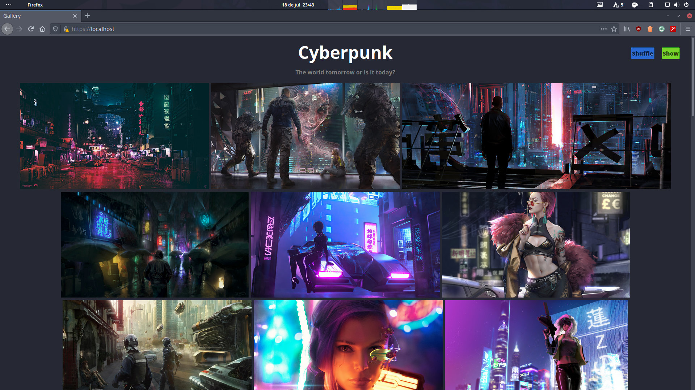

**AutoGallery** is a Pinterest-esque self-contained and static photo gallery that is automagically generated from a shell script and viewed in any browser.

I'm using [sachinchoolur/lightgallery.js](https://github.com/sachinchoolur/lightgallery.js) for the lightbox.

# Development
I intend to rewrite it in Python as a fully featured static web photo gallery.

**Features**
- Metadata in YAML file
- Timeline scrolling
- Tag searching
- Authentication
- PWA

**Minor**
- Browsing with keyboard arrows
- Outline when hovering cards

TODO: Rewrite AutoGallery in Python. +later

TODO: Optimize images for Web. +later

